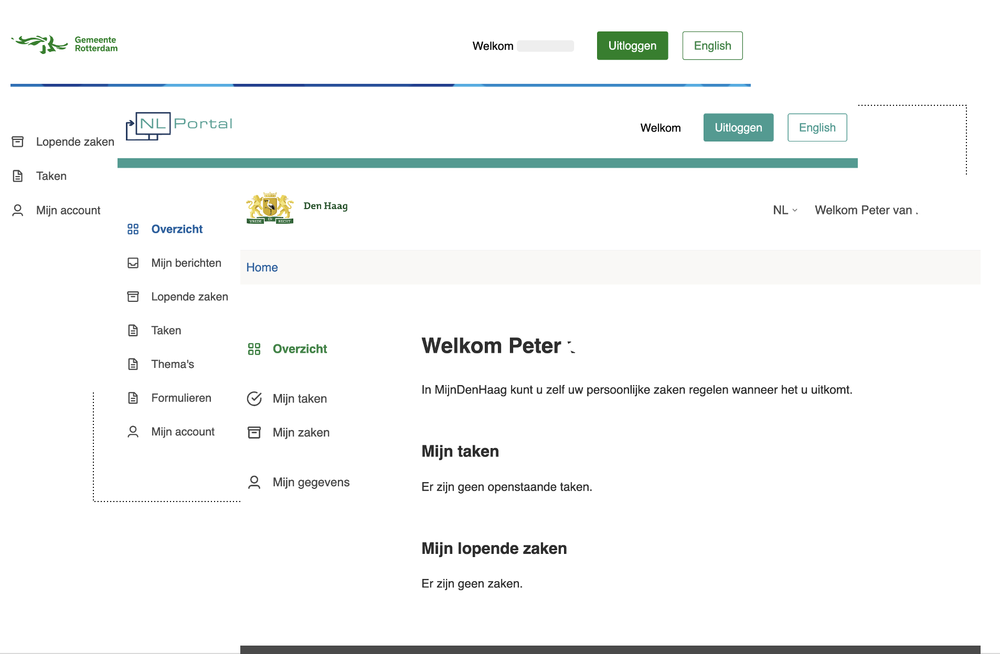
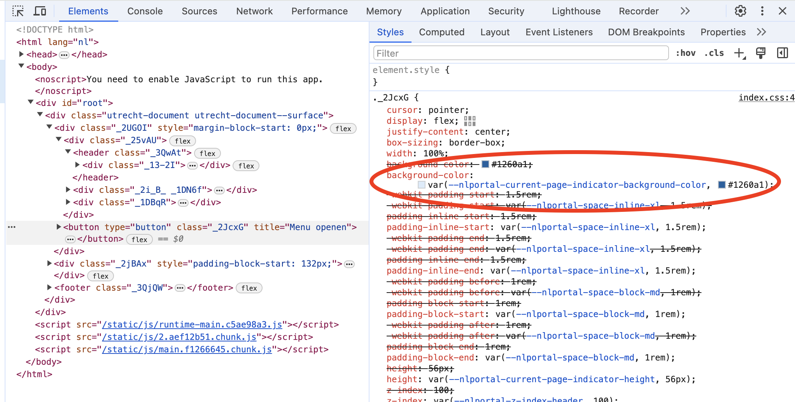

# Eigen vormgeving

NL Portal is opgebouwd met componenten gebaseerd op het [NL design system](https://nldesignsystem.nl/). Om je eigen NL Portal vorm te geven volgens de huisstijl kun je designtokens gebruiken. Designtokens zijn kleine stukjes van het designsysteem die ontwerpbeslissingen vertegenwoordigen zoals kleuren en lettertypes.

_Drie verschillende klantportalen met verschillende vormgeving door middel van design tokens_

## Via het Configuration Panel

De eenvoudigste manier om de huisstijl aan te passen is via het [Configuration Panel](configuration-panel.md). Hiermee kun je zonder code aan te passen:

* **Logo uploaden** — vervang het standaard logo door je eigen organisatielogo
* **Design tokens aanpassen** — pas kleuren, typografie en andere stijlen aan via de ingebouwde CSS-editor

In het Configuration Panel ga je naar de **Theme** sectie. Onder **Logo** kun je een afbeelding uploaden. Onder **Style** vind je een CSS-editor waarin je design tokens kunt toevoegen of overschrijven.

Een voorbeeld van een design token:

```css
--nlportal-header-bar-background-color: #03801f;
```

Hiermee wordt de kleur van de header bar ingesteld op #03801f.

Zie de [Configuration Panel](configuration-panel.md) pagina voor het opzetten van het Configuration Panel.

## Een thema activeren met een theme class

Een NL Design System-thema wordt geactiveerd met een class op het root-element. Zet de feature-eigenschap `nl-portal.config.features.properties.theme-class` (env: `NLPORTAL_CONFIG_FEATURES_PROPERTIES_THEMECLASS`) op de naam van je thema, bijvoorbeeld `denhaag-theme`. De frontend plaatst die class op het `<html>`-element, conform de [NL Design System-richtlijn](https://nldesignsystem.nl/handboek/developer/thema-maken/) dat de theme class op `<html>` (of `<body>`) hoort, zodat de token-overrides in het hele document doorwerken.

Dit staat los van de CSS-editor hierboven: die injecteert je token-overrides rechtstreeks. Schrijf die overrides op `:root` als je geen benoemd thema gebruikt; `theme-class` is alleen nodig wanneer je CSS onder een thema-class is gescoped.

## Design tokens vinden

De makkelijkste manier om te achterhalen met welk design token je een bepaald component kunt instellen is door in de [developer toolbar](https://developer.chrome.com/docs/devtools/overview) met de inspector te kijken.

_Een voorbeeld van het designtoken nlportal-current-page-indicator-background-color_

In het voorbeeld hierboven is een knop geselecteerd. In het omcirkelde deel is zichtbaar dat de achtergrondkleur van de knop wordt ingesteld met het designtoken `nlportal-current-page-indicator-background-color`.

## Geavanceerd: eigen vormgeving via code

Als je de vormgeving wilt beheren in versiebeheer of meer controle nodig hebt, kun je de design tokens ook aanpassen in een fork van de [NL Portal monorepo](https://github.com/nl-portal/nl-portal).

Ga naar het bestand `frontend/packages/app/src/styles/nl-portal-design-tokens.css` en voeg je eigen designtokens toe die de standaard waardes overschrijven. Bouw vervolgens je eigen images met `RUN_MODE=local docker compose --profile zgw --profile haalcentraal up -d --build`.

Zie [Opzetten NL Portal](opzetten-nl-portal.md) voor meer informatie over het forken en bouwen van eigen images.
