# Legacy token exchange (v1)

**Deze variant is gedeprecieerd.** Keycloak heeft de legacy token exchange als deprecated gemarkeerd en verwijdert hem in een toekomstige versie. Draai je Keycloak 26.2 of nieuwer, richt dan [Standard token exchange (v2)](keycloak-token-exchange-v2.md) in.

Deze pagina beschrijft de configuratie zoals die tot en met 3.0.x de enige mogelijkheid was. In 3.1.0 blijft v1 de standaardwaarde, dus een bestaande omgeving hoeft niets te veranderen.

Houd er wel rekening mee dat deze variant `admin-fine-grained-authz:v1` afdwingt voor de hele Keycloak server, en daarmee Fine-Grained Admin Permissions v2 blokkeert voor alle realms op die server. Zie [Keycloak configuratie](keycloak.md) voor de gevolgen.

## Vereiste server features

NL Portal gebruikt bij deze variant de legacy token exchange van Keycloak in combinatie met fine-grained admin permissions. Beide features moeten expliciet aangezet worden via de `KC_FEATURES` environment variabele van Keycloak. De juiste waarde verschilt per Keycloak versie:

| Keycloak versie | KC_FEATURES                                  |
| --------------- | -------------------------------------------- |
| ≤ 24            | `token-exchange,admin-fine-grained-authz`    |
| ≥ 26            | `token-exchange:v1,admin-fine-grained-authz:v1` |

**Let op:** vanaf Keycloak 26 activeert de vlag `token-exchange` zónder suffix de v2-variant; de `:v1` suffix is daarom verplicht.

## Realm en clients

Bij deze variant zijn drie clients nodig:

| Client (voorbeeldnaam)   | Type                                       | Doel                                                                  |
| ------------------------ | ------------------------------------------ | --------------------------------------------------------------------- |
| `nl-portal`              | public, standard flow                      | Login van de frontend (SPA). Draagt de `middel` mapper.               |
| `nl-portal-m2m`          | confidential, service accounts, met secret | Voert de token exchange uit namens de backend.                        |
| `nl-portal-token-exchange` | public, geen flows                       | Doelclient (audience) van de token exchange. Bevat de `aanvrager.bsn`/`aanvrager.kvk` mappers. |

De derde client bestaat alleen om die twee mappers te dragen. Keycloak bouwt de nieuwe token bij v1 op basis van de doelclient, en dus vuren de mappers van die client.

## Backend configuratie

```yaml
nl-portal:
    authentication:
        keycloak:
            token-exchange-version: v1
            resource: nl-portal-m2m
            audience: nl-portal-token-exchange
            credentials:
                secret: <secret van de m2m client>
```

Of met de environment variabelen van de app image:

```
KEYCLOAK_CLIENT_ID=nl-portal-m2m
KEYCLOAK_CLIENT_SECRET=<secret van de m2m client>
KEYCLOAK_TOKEN_EXCHANGE_AUDIENCE=nl-portal-token-exchange
```

`KEYCLOAK_TOKEN_EXCHANGE_VERSION` hoeft niet gezet te worden, `v1` is de standaardwaarde. De audience is bij deze variant verplicht en moet de doelclient noemen. Ontbreekt hij, dan meldt de applicatie dat bij het opstarten en faalt de eerste token exchange met een melding die de property benoemt.

## Hoe moet je Keycloak instellen

Maak een nieuwe client aan voor de backend.

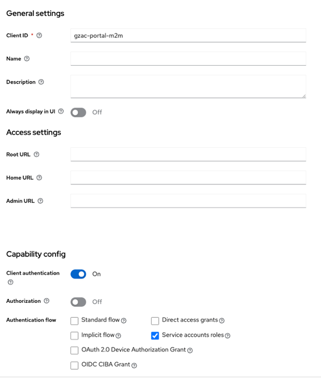

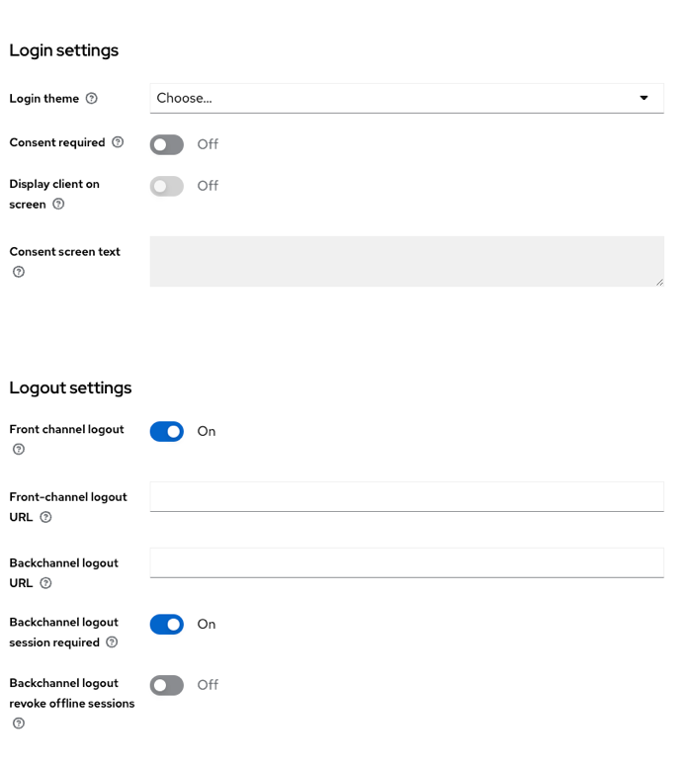

Op de credentials tab vind je de secret key die je in de application yaml moet zetten.

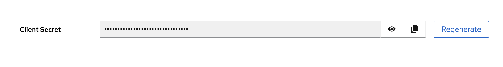
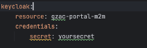

LET OP: niet zomaar op regenarate klikken dan veranderd de key en kan je niet de oude meer terug zetten.

Hierna creëer je nog een client deze is voor de token exchange.
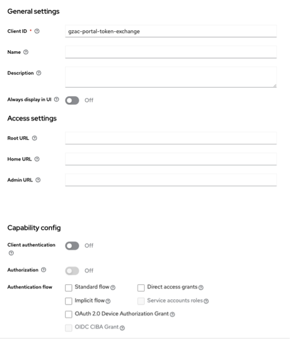
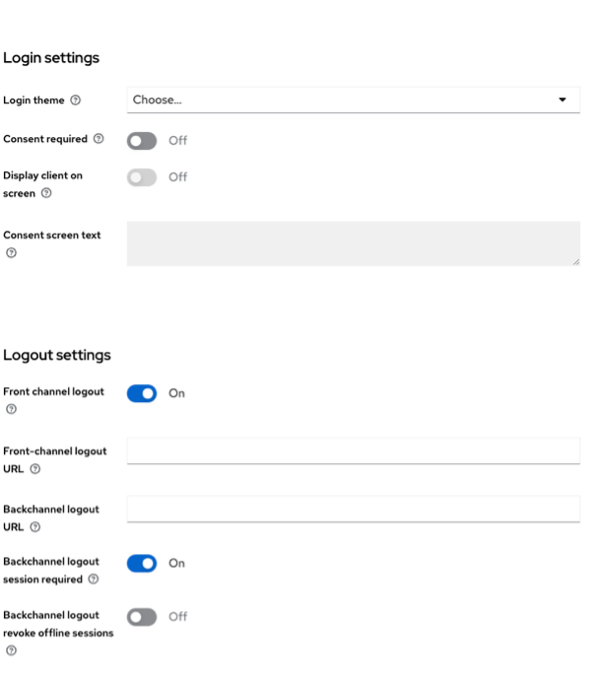


Navigeer naar de ‘Client scopes’ tab. Hier klik je op de 1e client scope.

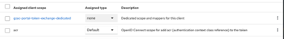

In ons geval met de naam ‘gzac-portal-token-exchange-dedicated’.

Hierin komen de mappers van de bsn en kvk.

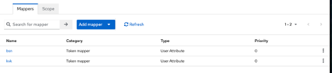

Ga terug naar client details en navigeer nu naar de tab ‘Permissions’.

Zorg dat de ‘permissions enabled’ op ‘on’ staat.

Je krijgt een permissions list te zien. Navigeer naar ‘token exchange’.

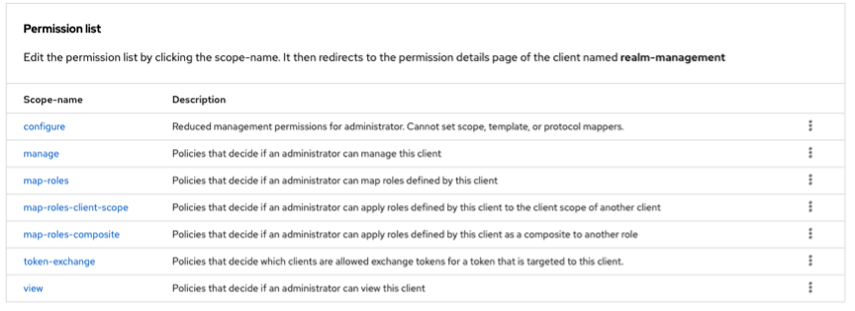

Hierin moet je een nieuwe polici maken om de backend client toegang te geven tot een token exchange.

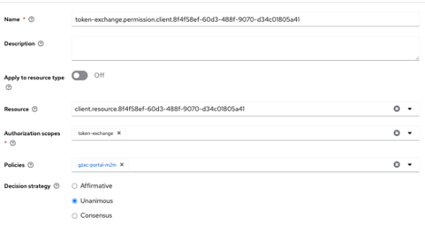

De policy.

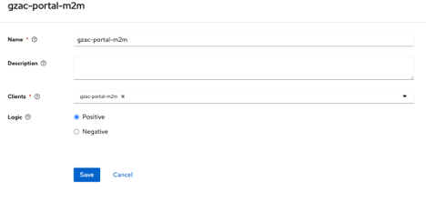

Hierna moet je nog naar de ‘oude’ al bestaande client om de mappers(kvk en bsn) weg te gooien bij
de al bestaande client die nu alleen nog gebruikt zal worden door de frontend.

In de backend moet je nu per omgeving een parameter zetten die de secret en de resource heeft om
de token exchange succesvol te kunnen runnen.

## Foutmeldingen

| Melding van Keycloak | Oorzaak |
| -------------------- | ------- |
| `Standard token exchange is not enabled for the requested client` | De `KC_FEATURES` vlaggen ontbreken of missen de `:v1` suffix, waardoor Keycloak het verzoek naar de v2 engine stuurt. |
