# Legacy token exchange (v1)

> **Deprecated.** De legacy token exchange is door Keycloak als verouderd gemarkeerd en zal daar verdwijnen. Binnen NL Portal blijft `v1` in de hele 4.x-lijn de standaardwaarde, zodat bestaande omgevingen niets hoeven te wijzigen. In **5.0** wordt `v2` de standaard en in een latere release verdwijnt `v1`.
>
> Draai je Keycloak 26.2 of hoger, richt dan de [standard token exchange (v2)](keycloak-token-exchange-v2.md) in. Die pagina bevat ook een [migratiepad zonder downtime](keycloak-token-exchange-v2.md#migratie-van-v1-naar-v2).

Deze pagina beschrijft de variant die vóór 4.0.0 de enige mogelijkheid was.

## Wat NL Portal van Keycloak vraagt

Deze variant werkt alleen op een Keycloak waarop **legacy token exchange** én **fine-grained admin permissions** zijn aangezet. Dat doe je met de `KC_FEATURES` environment variabele van Keycloak zelf; de namen van de features verschillen per Keycloak versie:

| Keycloak versie | `KC_FEATURES` |
| --------------- | ------------- |
| ≤ 25 | `token-exchange,admin-fine-grained-authz` |
| ≥ 26 | `token-exchange:v1,admin-fine-grained-authz:v1` |

Op Keycloak 26 zijn de `:v1` suffixen nodig omdat die versie beide features in twee generaties kent. Hoe je features aanzet staat verder in de [Keycloak documentatie](https://www.keycloak.org/securing-apps/token-exchange); dat valt buiten het beheer van NL Portal.

Twee gevolgen die je bij de afweging moet meenemen:

* **Beide features zijn door Keycloak als verouderd gemarkeerd** en verdwijnen op termijn. Daarmee verdwijnt ook deze variant.
* **Fine-grained admin permissions gelden serverbreed**, niet per realm. Eén realm die hierop leunt blokkeert Fine-Grained Admin Permissions v2 voor álle realms op die server.

Beide redenen wijzen dezelfde kant op: richt nieuwe omgevingen in op [v2](keycloak-token-exchange-v2.md) en migreer bestaande.

## Clients

In deze variant zijn drie clients nodig:

| Client (voorbeeldnaam) | Type | Doel |
| ---------------------- | ---- | ---- |
| `nl-portal` | public, standard flow | Login van de frontend (SPA). Draagt de `middel` mapper. |
| `nl-portal-m2m` | confidential, service accounts, met secret | Voert de token exchange uit namens de backend. |
| `nl-portal-token-exchange` | public, geen flows | Doelclient (audience) van de token exchange. Bevat de `aanvrager.bsn`/`aanvrager.kvk` mappers. |

De derde client bestaat uitsluitend om die twee mappers te dragen: bij legacy token exchange bouwt Keycloak de nieuwe token op vanuit de **doelclient**, en vuurt daarbij de mappers van die client af. In [v2](keycloak-token-exchange-v2.md) gebeurt dat vanuit de aanvragende client en is deze client dus overbodig.

## Backend configuratie

```yaml
nl-portal:
    authentication:
        keycloak:
            token-exchange-version: v1
            resource: nl-portal-m2m
            audience: nl-portal-token-exchange
            credentials:
                secret: <secret van de m2m client>
```

Of via de environment variabelen van de app image:

```
KEYCLOAK_CLIENT_ID=nl-portal-m2m
KEYCLOAK_CLIENT_SECRET=<secret>
KEYCLOAK_TOKEN_EXCHANGE_AUDIENCE=nl-portal-token-exchange
```

`KEYCLOAK_TOKEN_EXCHANGE_VERSION` hoef je niet te zetten: `v1` is de standaardwaarde.

De `audience` is bij v1 **verplicht** en moet de doelclient noemen. Ontbreekt die waarde, dan start de applicatie niet op en noemt de foutmelding de property:

```
nl-portal.authentication.keycloak.audience is required when token-exchange-version is v1
```

Deze controle draait zodra er een Keycloak client is ingesteld, dus zodra `resource` (`KEYCLOAK_CLIENT_ID`) gevuld is. Is er helemaal geen client ingesteld, dan slaat de applicatie de controle over en start zij wel op: er wordt in dat geval ook nooit een token exchange uitgevoerd. In een echte deployment doet die situatie zich niet voor — de app image kent geen standaardwaarde voor `KEYCLOAK_CLIENT_ID` en start zonder die variabele sowieso niet op.

Bij het opstarten logt de applicatie de gekozen variant:

```
Keycloak token exchange mode: V1
```

Daarop volgt een waarschuwing dat v1 verouderd is. Die waarschuwing verdwijnt zodra je op [v2](keycloak-token-exchange-v2.md) overstapt.

## Hoe moet je Keycloak instellen

Maak een nieuwe client aan voor de backend.

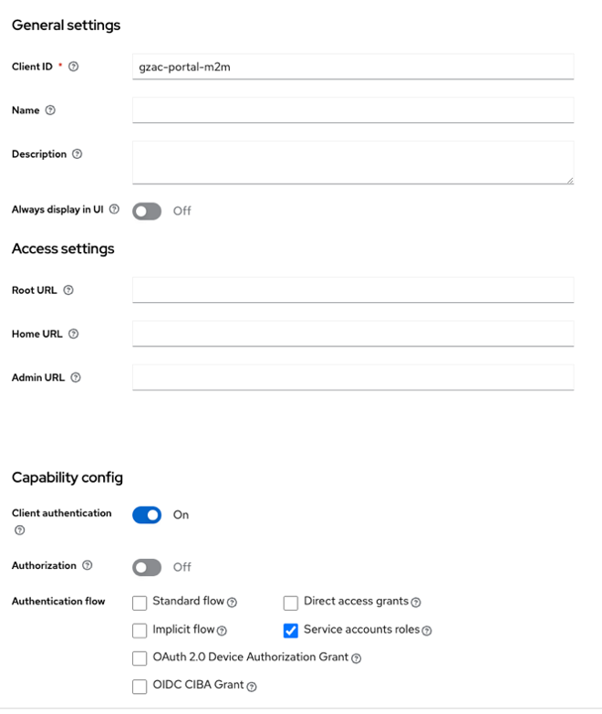

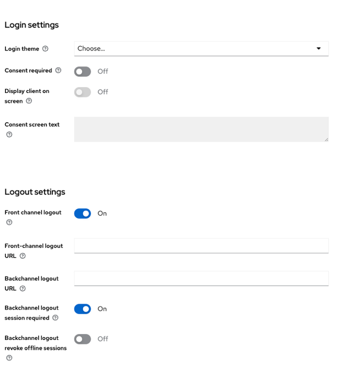

Op de credentials tab vind je de secret key die je in de application yaml moet zetten.

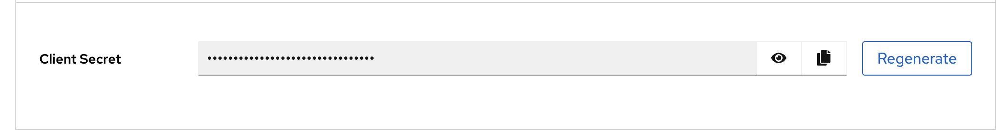
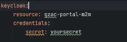

**Let op:** niet zomaar op regenerate klikken, dan verandert de key en kan je de oude niet meer terugzetten.

Hierna creëer je nog een client, deze is voor de token exchange.
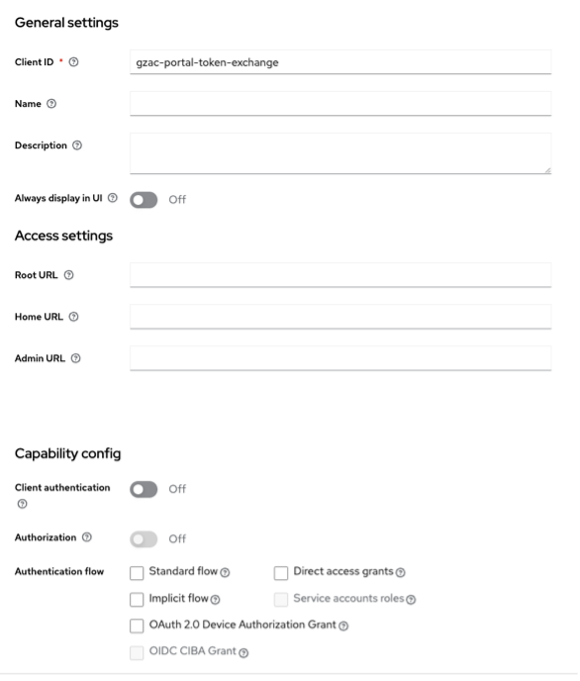
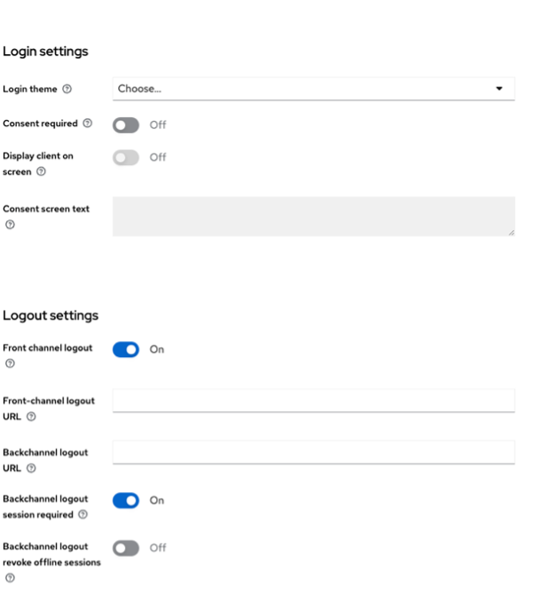

Navigeer naar de 'Client scopes' tab. Hier klik je op de 1e client scope.

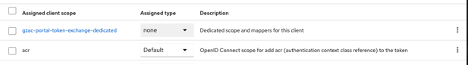

In ons geval met de naam `nl-portal-token-exchange-dedicated`. De schermafbeeldingen hierboven komen uit een oudere omgeving en tonen nog de naam `gzac-portal-token-exchange-dedicated`; de werkwijze is identiek.

Hierin komen de mappers van de bsn en kvk.

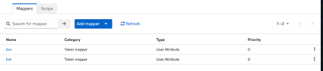

Ga terug naar client details en navigeer nu naar de tab 'Permissions'.

Zorg dat de 'permissions enabled' op 'on' staat.

Je krijgt een permissions list te zien. Navigeer naar 'token exchange'.

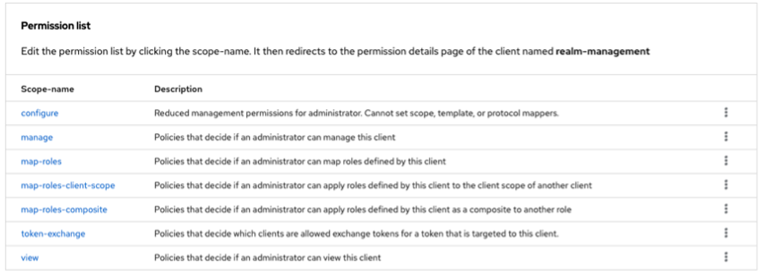

Hierin moet je een nieuwe policy maken om de backend client toegang te geven tot een token exchange.

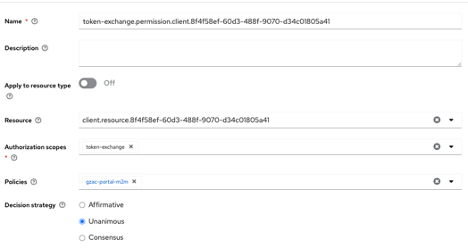

De policy.

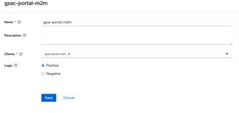

Hierna moet je nog naar de 'oude' al bestaande client om de mappers (kvk en bsn) weg te gooien bij de al bestaande client die nu alleen nog gebruikt zal worden door de frontend.

In de backend moet je nu per omgeving een parameter zetten die de secret en de resource heeft om de token exchange succesvol te kunnen runnen.

## Foutmeldingen

Mislukt de token exchange, dan logt de backend de melding van Keycloak op niveau `ERROR`, inclusief de ingestelde variant. De gebruiker in de browser krijgt die details **niet** te zien: de portal geeft een algemene foutmelding terug. Zoek bij een storing dus altijd in de log van de backend; onderstaande melding vind je daar, niet in de frontend.

De regel in de log heeft deze vorm; de melding van Keycloak is het JSON-fragment aan het eind, in het veld `error_description`:

```
Token exchange failed with status <status> in V1 mode: {"error":"<code>","error_description":"<melding>"}
```

| Melding van Keycloak | Oorzaak |
| -------------------- | ------- |
| `Standard token exchange is not enabled for the requested client` | De legacy token exchange staat niet aan op je Keycloak. Het verzoek belandt dan bij de standaard (v2) engine, die op haar beurt de client-instelling mist. Zet de feature aan, of stap over op [v2](keycloak-token-exchange-v2.md). |
