# Keycloak configuratie

NL Portal gebruikt Keycloak voor de authenticatie van gebruikers. Deze pagina beschrijft alle vereisten om een Keycloak in te richten voor gebruik met de NL Portal: de benodigde server features, clients, token exchange, gebruikersattributen en claims.

Deze documentatie beschrijft de **burger flow** (gebruiker met BSN, ingelogd via DigiD) en de **generieke gebruikersflow** (Keycloak gebruiker zonder BSN of KVK). Voor overige flows, zoals bedrijven (eHerkenning) en machtigingen, verwijzen we naar de broncode of [support](../support-en-resources/community-en-support.md). Zie [Overige flows](#overige-flows).

## Vereiste server features

NL Portal gebruikt de **legacy (v1) token exchange** van Keycloak in combinatie met fine-grained admin permissions. De standaard (v2) token exchange die Keycloak vanaf versie 26 standaard aanbiedt wordt **niet** ondersteund.

Beide features moeten expliciet aangezet worden via de `KC_FEATURES` environment variabele van Keycloak. De juiste waarde verschilt per Keycloak versie:

| Keycloak versie | KC_FEATURES                                  |
| --------------- | -------------------------------------------- |
| ≤ 24            | `token-exchange,admin-fine-grained-authz`    |
| ≥ 26            | `token-exchange:v1,admin-fine-grained-authz:v1` |

**Let op:** vanaf Keycloak 26 activeert de vlag `token-exchange` zónder suffix de v2-variant; de `:v1` suffix is daarom verplicht.

Zie de [officiële Keycloak documentatie](https://www.keycloak.org/securing-apps/token-exchange) voor de verschillen tussen de v1 (legacy) en v2 (standaard) token exchange.

## Realm en clients

In het realm van de NL Portal zijn drie clients nodig:

| Client (voorbeeldnaam)   | Type                                       | Doel                                                                  |
| ------------------------ | ------------------------------------------ | --------------------------------------------------------------------- |
| `nl-portal`              | public, standard flow                      | Login van de frontend (SPA). Draagt de `middel` mapper.               |
| `nl-portal-m2m`          | confidential, service accounts, met secret | Voert de token exchange uit namens de backend.                        |
| `nl-portal-token-exchange` | public, geen flows                       | Doelclient (audience) van de token exchange. Bevat de `aanvrager.bsn`/`aanvrager.kvk` mappers. |

De clients koppel je aan de backend via de volgende environment variabelen van de app image (zie ook de [Deployment guide](deployment-guide.md)):

| Variabele                          | Keycloak client                          |
| ---------------------------------- | ---------------------------------------- |
| `KEYCLOAK_CLIENT_ID`               | Client id van de m2m (backend) client    |
| `KEYCLOAK_CLIENT_SECRET`           | Secret van de m2m (backend) client       |
| `KEYCLOAK_TOKEN_EXCHANGE_AUDIENCE` | Client id van de token-exchange client   |

## Token exchange

Als je een api call doet naar de backend wordt de token onderschept en wordt er een call naar Keycloak gedaan en hier wordt een nieuwe token opgehaald waar de bsn/kvk wel in zit. Deze wordt nu gebruikt in de verdere applicatie.

### Hoe moet je Keycloak instellen

Maak een nieuwe client aan voor de backend.

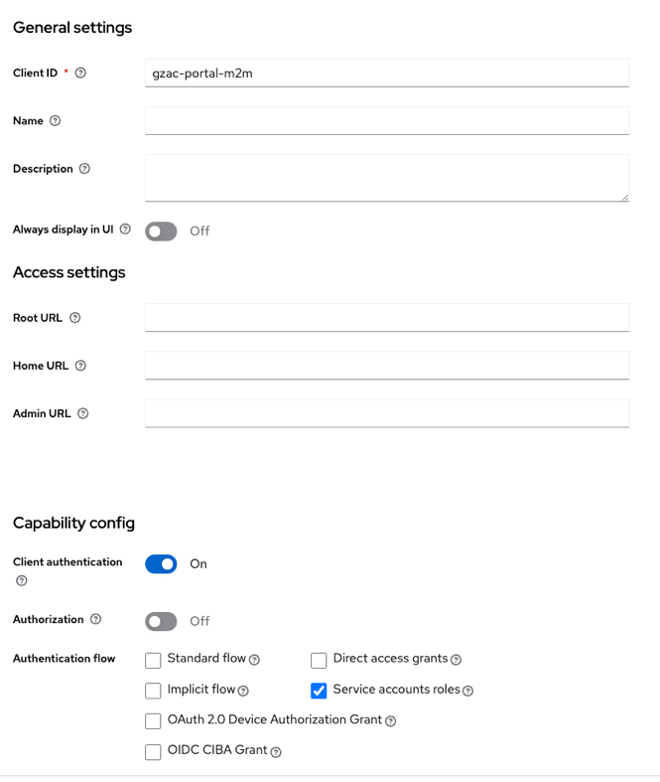

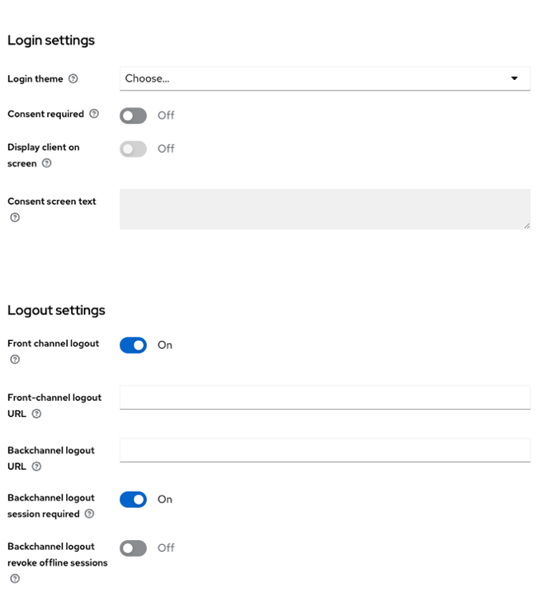

Op de credentials tab vind je de secret key die je in de application yaml moet zetten.

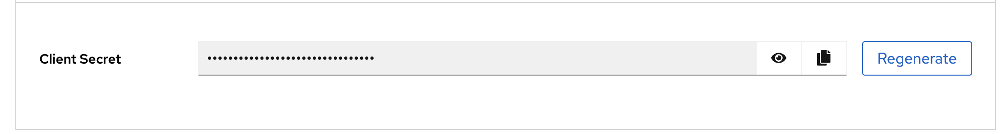
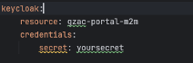

LET OP: niet zomaar op regenarate klikken dan veranderd de key en kan je niet de oude meer terug zetten.

Hierna creëer je nog een client deze is voor de token exchange.
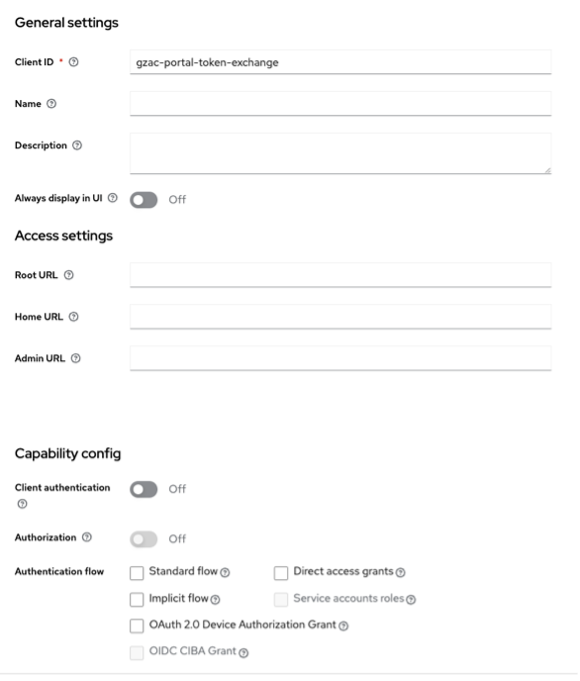
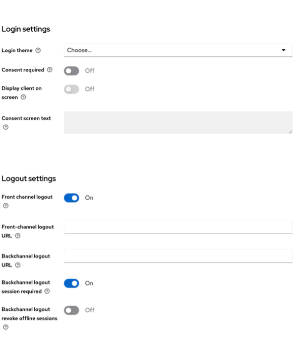

Navigeer naar de ‘Client scopes’ tab. Hier klik je op de 1e client scope.

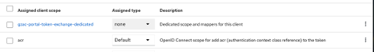

In ons geval met de naam ‘gzac-portal-token-exchange-dedicated’.

Hierin komen de mappers van de bsn en kvk.

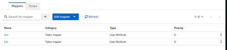

Ga terug naar client details en navigeer nu naar de tab ‘Permissions’.

Zorg dat de ‘permissions enabled’ op ‘on’ staat.

Je krijgt een permissions list te zien. Navigeer naar ‘token exchange’.

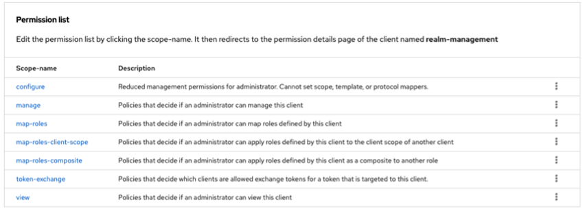

Hierin moet je een nieuwe polici maken om de backend client toegang te geven tot een token exchange.

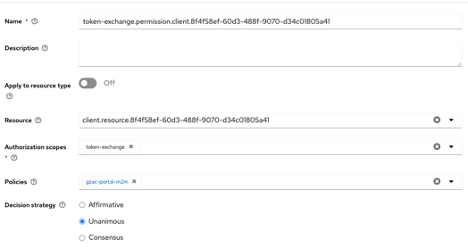

De policy.

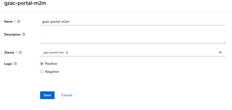

Hierna moet je nog naar de ‘oude’ al bestaande client om de mappers(kvk en bsn) weg te gooien bij
de al bestaande client die nu alleen nog gebruikt zal worden door de frontend.

In de backend moet je nu per omgeving een parameter zetten die de secret en de resource heeft om
de token exchange succesvol te kunnen runnen.

## Gebruikersattributen: burger flow

De backend bepaalt het type gebruiker op basis van claims in de **geëxchangede** token:

1. Claim `aanvrager.bsn` aanwezig → de gebruiker is een **burger**.
2. Claim `aanvrager.kvk` aanwezig → de gebruiker is een **bedrijf** (zie [Overige flows](#overige-flows)).
3. Geen van beide → de gebruiker is een **generieke gebruiker** (zie [Generieke gebruikers](#generieke-gebruikers-sub-flow)).

Voor de burger flow betekent dit:

* De gebruiker in het portal realm heeft een **user attribute** `bsn` (bijvoorbeeld `999993847`).
* Op de **token-exchange client** staat een protocol mapper (type *User Attribute*) die het user attribute `bsn` mapt naar de claim `aanvrager.bsn` in het access token.
* Daarnaast heeft de gebruiker het user attribute `authenticationMethod` met waarde `digid`, dat via de `middel` claim de frontend features bepaalt (zie [De middel claim](#de-middel-claim)).

Een burger heeft daarmee toegang tot onder andere de Mijn Gegevens pagina (BRP gegevens via Haal Centraal) en ziet zaken waarop hij of zij als initiator met dat BSN geregistreerd staat.

## Generieke gebruikers (sub flow)

Een gebruiker zonder `aanvrager.bsn` of `aanvrager.kvk` claim wordt behandeld als generieke Keycloak gebruiker. De backend identificeert deze gebruiker met de eerste 13 karakters van de `sub` claim, met identificatietype `uid`.

Voor generieke gebruikers werkt een deel van de portal functionaliteit:

| Functionaliteit          | Werkt voor generieke gebruiker? | Toelichting                                                                                  |
| ------------------------ | ------------------------------- | -------------------------------------------------------------------------------------------- |
| Zaken                    | Ja                              | Zaken moeten een rol hebben met `betrokkeneIdentificatie.natuurlijkPersoon.anpIdentificatie` gelijk aan de uid (eerste 13 karakters van `sub`). |
| Taken                    | Ja                              | Taakobjecten met `identificatie.type` = `uid` en `identificatie.value` = de uid.             |
| Berichten                | Ja                              | Berichtobjecten met dezelfde uid-identificatie.                                              |
| Mijn Gegevens (BRP)      | Nee                             | Vereist een burger (BSN); de pagina toont geen gegevens.                                     |
| OpenKlant 2 (partijen)   | Nee                             | Vereist een burger of bedrijf; queries geven een foutmelding.                                |

## De middel claim

De frontend leest de claim `middel` uit het access token van de **frontend client** en bepaalt daarmee welke features actief zijn. De standaard app image is geconfigureerd met de volgende authenticatiemethoden (aanpasbaar in een fork, zie `frontend/src/App.tsx` in de NL Portal App repository):

| Categorie | Waarden van `middel`           | Gedrag                                                |
| --------- | ------------------------------ | ----------------------------------------------------- |
| person    | `digid`, `machtigen`           | Persoonsweergave: Mijn Gegevens toont BRP gegevens.   |
| company   | `eherkenning`, `bewindvoering` | Bedrijfsweergave (zie [Overige flows](#overige-flows)). |
| proxy     | `machtigen`, `bewindvoering`   | Machtigingsflow (zie [Overige flows](#overige-flows)). |

Voor de burger flow stel je dit in met:

* Het user attribute `authenticationMethod` met waarde `digid` op de gebruiker.
* Een protocol mapper (type *User Attribute*) op de **frontend client** die het user attribute `authenticationMethod` mapt naar de claim `middel` in het access token.

**Let op:** als de `middel` claim ontbreekt valt de frontend terug op de persoonsweergave. De Mijn Gegevens pagina toont dan alleen gegevens als de gebruiker ook daadwerkelijk een burger is (BSN attribuut én mapper correct ingesteld). Is dat niet het geval, dan toont de pagina een foutmelding.

## Externe identity providers

De attributen `bsn` en `authenticationMethod` zijn **user attributes op de Keycloak gebruiker** in het portal realm. Wanneer gebruikers via een externe identity provider inloggen (bijvoorbeeld Azure AD of DigiD via identity brokering), bestaan deze attributen niet vanzelf. Configureer in dat geval **identity provider mappers** in Keycloak die de attributen bij het inloggen op de gebruiker zetten. De protocol mappers op de clients (zie hierboven) mappen de attributen vervolgens naar de claims.

## Referentieconfiguratie

De docker-compose demo-omgeving in de NL Portal App repository bevat een volledig werkend voorbeeld van alle bovenstaande configuratie. Gebruik deze als referentie bij het inrichten van een eigen Keycloak:

* `docker-compose.yaml` — de Keycloak service met de juiste `KC_FEATURES` waarde.
* `imports/keycloak/nlportal-realm.json` — een volledig realm met de drie clients, de token exchange permission, de protocol mappers voor `aanvrager.bsn`, `aanvrager.kvk` en `middel`, en testgebruikers (`burger` met BSN attribuut en `authenticationMethod` `digid`, `bedrijf` met KVK attribuut en `authenticationMethod` `eherkenning`).

## Overige flows

Naast de burger flow en de generieke gebruikersflow ondersteunt de NL Portal ook bedrijven (KVK / eHerkenning) en machtigingsflows (`machtigen`, `bewindvoering`). Deze flows zijn niet in deze documentatie uitgewerkt. Raadpleeg hiervoor de broncode (de module `zgw/common-ground-authentication` in de Backend Libraries repository en de frontend van de NL Portal App repository) of neem contact op via [Community en support](../support-en-resources/community-en-support.md).
