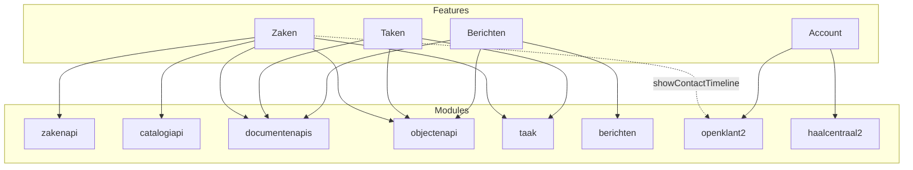

# Module afhankelijkheden

Overzicht van welke NL Portal modules geconfigureerd moeten zijn per feature.

> **Let op:** Dit overzicht is gebaseerd op de laatst beschikbare major/minor release en geldt voor de standaard NL Portal app-configuratie. Eigen implementaties kunnen andere frontend-vereisten hebben, maar backend module-afhankelijkheden (zoals taak → objectenapi) blijven van toepassing.

## Afhankelijkheidsgrafiek

## Afhankelijkheidsmatrix

| Feature | zakenapi | catalogiapi | documentenapis | objectenapi | taak | berichten | openklant2 | haalcentraal2 |
|---|:---:|:---:|:---:|:---:|:---:|:---:|:---:|:---:|
| Zaken | ✓ | ✓ | ✓ | ✓ | ✓ | | ¹ | |
| Taken | | | ✓ | ✓ | ✓ | | | |
| Berichten | | | ✓ | ✓ | | ✓ | | |
| Account | | | | | | | ✓ | ✓ |

¹ Alleen vereist als `showContactTimeline` aan staat
