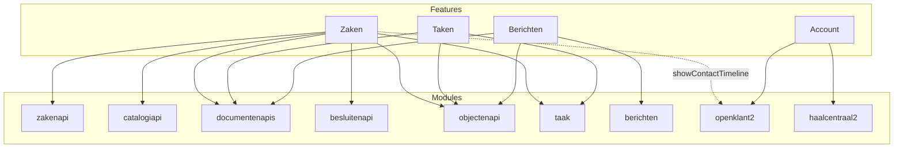
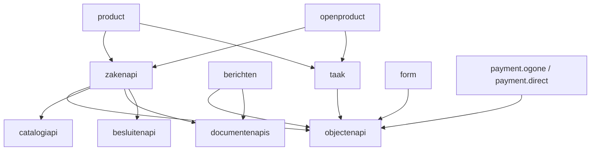

# Module afhankelijkheden

Deze pagina beschrijft wat je moet aanzetten om de NL Portal werkend te krijgen, in twee lagen:

* [Features](#features): welke modules een feature nodig heeft. Begin hier als je weet wat de portal
  moet kunnen.
* [Modules](#modules): welke modules elkaar nodig hebben, en in welke volgorde je ze aanzet. Lees dit
  voordat je iets aanzet, want een module die zijn vereisten mist doet stil niets.

> **Let op:** Dit overzicht is gebaseerd op de laatst beschikbare major/minor release en geldt voor de standaard nl-portal-app configuratie. Eigen implementaties kunnen andere frontend-vereisten hebben, maar backend module-afhankelijkheden (zoals taak → objectenapi) blijven van toepassing.

## Features

Welke modules aan moeten voor de features van de standaard app. Een pijl betekent "heeft nodig".

```mermaid
flowchart TB
    subgraph features["Features"]
        zaken["Zaken"]
        taken["Taken"]
        berichten["Berichten"]
        account["Account"]
    end

    subgraph modules["Modules"]
        zakenapi["zakenapi"]
        catalogiapi["catalogiapi"]
        documentenapis["documentenapis"]
        besluitenapi["besluitenapi"]
        objectenapi["objectenapi"]
        taak["taak"]
        berichtenmod["berichten"]
        openklant2["openklant2"]
        haalcentraal2["haalcentraal2"]
    end

    zaken --> zakenapi
    zaken --> catalogiapi
    zaken --> documentenapis
    zaken --> besluitenapi
    zaken --> objectenapi
    zaken --> taak
    zaken -.->|"showContactTimeline"| openklant2

    taken --> objectenapi
    taken --> taak
    taken --> documentenapis

    berichten --> objectenapi
    berichten --> berichtenmod
    berichten --> documentenapis

    account --> haalcentraal2
    account --> openklant2
```

| Feature | zakenapi | catalogiapi | documentenapis | besluitenapi | objectenapi | taak | berichten | openklant2 | haalcentraal2 |
|---|:---:|:---:|:---:|:---:|:---:|:---:|:---:|:---:|:---:|
| Zaken | ✓ | ✓ | ✓ | ✓ ² | ✓ | ✓ | | ¹ | |
| Taken | | | ✓ | | ✓ | ✓ | | | |
| Berichten | | | ✓ | | ✓ | | ✓ | | |
| Account | | | | | | | | ✓ | ✓ |

¹ Alleen vereist als `showContactTimeline` aan staat

² Niet vanwege de feature zelf, maar omdat `zakenapi` niet activeert zonder `besluitenapi`. Zie
[Vereisten per module](#vereisten-per-module).

De modules `form`, `product`, `openproduct`, `payment` en `virusscan.clamav` horen niet bij één van
deze vier features. Hun vereisten staan bij [Modules](#modules).

## Modules

Modules hebben elkaars beans nodig. Dit deel zegt welke, en in welke volgorde je ze aanzet.

### Waarom de volgorde uitmaakt

Staat een vereiste module uit, dan activeert de module zichzelf niet. Er komt geen foutmelding en de
applicatie start normaal op; de functionaliteit is simpelweg afwezig. Zet je bijvoorbeeld `zakenapi`
aan zonder `catalogiapi`, dan werken zaken niet en zie je dat nergens terug.

> **Regel:** zet een module pas aan wanneer al zijn vereisten aanstaan. Alles in één
> configuratiewijziging aanzetten mag ook. Werkt een module niet, controleer dan eerst of alle
> vereisten uit de tabel hieronder aanstaan.

**In oudere versies** liep een deel van deze combinaties niet stil af, maar faalde de applicatie
tijdens het opstarten met een `NoSuchBeanDefinitionException`, en in Kubernetes met een crash loop.
Zet je bijvoorbeeld `zakenapi`, `catalogiapi` en `objectenapi` aan zonder `documentenapis`, dan
gebeurde dat. De module activeert nu netjes niet meer in plaats van te crashen. Zie je dit alsnog,
dan draait er een versie van voor die correctie.

Dit geldt in het bijzonder bij configuratie via het [Configuration Panel](configuration-panel.md) en
Spring Cloud Config, omdat je daar per wijziging opslaat en de applicatie tussentijds herstart.

### Vereisten per module

Zoek de module op die je wilt aanzetten en zet eerst alles uit de rechterkolom aan. Wil je meerdere
modules, neem dan de vereisten van allemaal samen. Wat er niet bij staat, heb je niet nodig.

| Wil je aanzetten | Zet eerst aan |
| --- | --- |
| `objectenapi`, `catalogiapi`, `documentenapis`, `besluitenapi` | niets |
| `openklant2`, `haalcentraal2`, `haalcentraal.hr`, `virusscan.clamav` | niets |
| `form` | `objectenapi` |
| `taak` | `objectenapi` |
| `payment.ogone`, `payment.direct` | `objectenapi` |
| `berichten` | `objectenapi`, `documentenapis` |
| `zakenapi` | `objectenapi`, `catalogiapi`, `documentenapis`, `besluitenapi` |
| `product` ¹ | `objectenapi`, `catalogiapi`, `documentenapis`, `besluitenapi`, `zakenapi`, `taak` |
| `openproduct` | `objectenapi`, `catalogiapi`, `documentenapis`, `besluitenapi`, `zakenapi`, `taak` |

¹ `dmn` en `prefill` zijn schakelaars binnen de product module, geen aparte modules. Ze bepalen welke
onderdelen van `product` actief zijn en hebben dezelfde vereisten.

Uitzetten gaat in omgekeerde richting: zet eerst de modules uit die iets nodig hebben, daarna hun
vereisten.

### Modules onderling

Een pijl betekent "heeft nodig", net als in de grafiek bij [Features](#features).

```mermaid
flowchart TB
    product["product"]
    openproduct["openproduct"]
    zakenapi["zakenapi"]
    berichten["berichten"]
    taak["taak"]
    form["form"]
    payment["payment.ogone / payment.direct"]
    objectenapi["objectenapi"]
    catalogiapi["catalogiapi"]
    documentenapis["documentenapis"]
    besluitenapi["besluitenapi"]

    product --> zakenapi
    product --> taak
    openproduct --> zakenapi
    openproduct --> taak
    zakenapi --> objectenapi
    zakenapi --> catalogiapi
    zakenapi --> documentenapis
    zakenapi --> besluitenapi
    berichten --> objectenapi
    berichten --> documentenapis
    taak --> objectenapi
    form --> objectenapi
    payment --> objectenapi
```

De modules `openklant2`, `haalcentraal2`, `haalcentraal.hr` en `virusscan.clamav` staan niet in de
grafiek. Die hebben geen andere module nodig en kun je op elk moment aanzetten.
