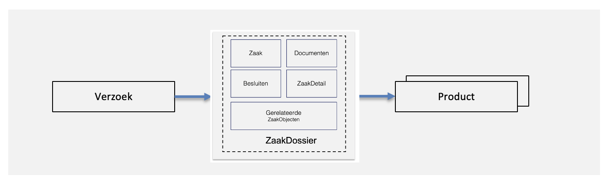

# Open Product

Een product is mogelijk resultaat van een verzoek. Het formaat van een product is gestandaardiseerd in een JSON formaat. Het verzoek kan worden aangemaakt via een component naar keuze, in veel gevallen een zaak- of taakafhandelapplicatie. Voorbeelden van producten zijn een vergunning of rijbewijs.

_Producten worden nog gestandaardiseerd opgeslagen in Open product

Meer informatie over [OpenProduct](https://github.com/maykinmedia/open-product)

## Onderdelen
Hier onder de verschillende onderdelen

### Thema
Een thema is een verzameling van producttypen. Producttypen vallen onder één of meerdere thema's. Thema's hebben een boomstructuur en kunnen onderdeel zijn van een ander thema.

* Een thema kan onderdeel zijn van een ander thema, via hoofd_thema kan het hoofd thema worden gedefinieerd.
* Een thema kan niet het hoofd thema van zichzelf zijn.
* Een thema moet gepubliceerd zijn voordat zijn sub thema's kunnen worden gepubliceerd.
* Een thema kan niet ongepubliceerd worden als het gepubliceerde sub thema's heeft.
* Een thema niet worden verwijderd als het sub thema's heeft of als er producttypen zijn die aleen gekoppeld zijn aan dit thema.

### Producttype
Een Producttype is de definitie van een Product. Hierin wordt alle relevante data opgeslagen zoals informatie over de aanvraag.

Een product is een instantie van een producttype (zie Producttypen API), in een product worden onder andere de gegevens van de eigenaar, de benodigde data voor het product en bijvoorbeeld de status vastgelegd.

Een producttype kan worden gelinkt één of meerdere locaties, organisaties en/of contacten.

Daarnaast kunnen de volgende objecten per producttype worden aangemaakt:

* externe codes
* parameters
* zaaktypen
* verzoektypen
* processen
* content
* prijzen
* prijsopties
* prijsregels
* links
* bestanden
* acties
Via toegestane statussen kan worden aangegeven welke statussen een product van het producttype mag hebben.

#### Zaaktype, verzoektype & proces
Een zaaktype is een verwijzing naar een zaaktype uit de catalogi API Verzoektypen & processen zijn verwijzingen naar verzoektypen & processen uit externe API's. Een verwijzing kan als een URN en/of URL worden opgeslagen waarna via URN_MAPPING_CONFIG de missende urn/url automatisch wordt ingevuld.

#### Externe code
Externe codes zijn bedoeld voor de producttype code van hetzelfde soort product uit externe systemen.

#### Parameter
Parameters zijn bedoeld voor attributen voor een specifiek producttype (en alle bijbehorende producten).

### Content & ContentLabel
Per producttype kunnen contentelementen worden aangemaakt. Dit zijn (markdown) content blokken waarin verschillende informatie kan worden ingevuld om te tonen op bijvoorbeeld de gemeente website. Aan een content element kunnen labels worden gelinkt om aan te geven wat het element bevat.

### Prijs
Voor producttypen kunnen prijzen worden toegevoegd die op een bepaalde datum ingaan. Een prijs kan één of meerdere opties of één of meerdere regels hebben. Opties zijn bedoeld voor producten met bijvoorbeeld alleen een normale & spoed prijs. Prijs regels is bedoeld voor complexere logica en is een link naar een DMN tabel in een externe applicatie.

### Schema
Jsonschema's zijn JSON objecten die worden gebruikt om andere JSON te valideren (zie jsonschema). Schema's kunnen worden gelinkt aan een producttype als dataobject_schema of verbruiksobject_schema om de velden dataobject & verbruiksobject van producten te valideren.

### Link & Bestand
Aan een producttype kunnen handige links en bestanden worden gekoppeld waar meer informatie over het producttype te vinden is.
Wordt momenteel niet gebruikt in NL Portal

### Actie
Aan een producttype kunnen meerdere acties worden gekoppeld. Dit is een directe verwijzing naar een url van een formulier of naar een DMN tabel uit een externe applicatie om een product bijvoorbeeld op te zeggen of te verlengen.

### Locatie
Een locatie kan aan een producttype worden gelinkt om bijvoorbeeld aan te geven waar het product is aan te vragen. 
Wordt momenteel niet gebruikt in NL Portal

### Organisatie & Contact
Een organisatie kan aan een producttype worden gelinkt om aan te geven welke organisaties & instanties betrokken zijn bij het producttype. Daarnaast kan ook een contact (persoon) van een organisaties aan een producttype worden gelinkt.
Wordt momenteel niet gebruikt in NL Portal

### Product
Een product is een instantie van een producttype (zie producttypen API), in een product worden onder andere de gegevens van de eigenaar, de benodigde data voor het product en bijvoorbeeld de status vastgelegd. Specifieke product data kan worden opgeslagen in de JSON velden dataobject en verbruiksobject. Deze velden worden gevalideerd door de verbruiksobject_schema & dataobject_schema velden van het producttype (zie jsonschema). De status van een product kan alleen worden veranderd naar de een van de toegestane statussen gedefineerd op het producttype.

#### Eigenaar
Aan een product kunnen één of meerdere eigenaren worden gelinkt. Een eigenaar kan een Klant/Partij (Klantinteracties API), natuurlijk of niet natuurlijke persoon zijn.

#### Document, Zaak, Taak
Een document is een verwijzing naar een EnkelvoudigInformatieObject uit de documenten API. Een zaak is een verwijzing naar een Zaak uit de zaken API. Taken is een verwijzingen naar taken uit externe API's. Een verwijzing kan als een URN en/of URL worden opgeslagen waarna via URN_MAPPING_CONFIG de missende urn/url automatisch wordt ingevuld.

## Wat kan je tonen?
De onderdelen die getoond worden zijn op basis van de ingelogde gebruiker. 
Bijvoorbeeld om hoofdthema's in het zijmenu te tonen, worden alleen hoofdthema's getoond op basis van de producten van de ingelogde gebruiker.

